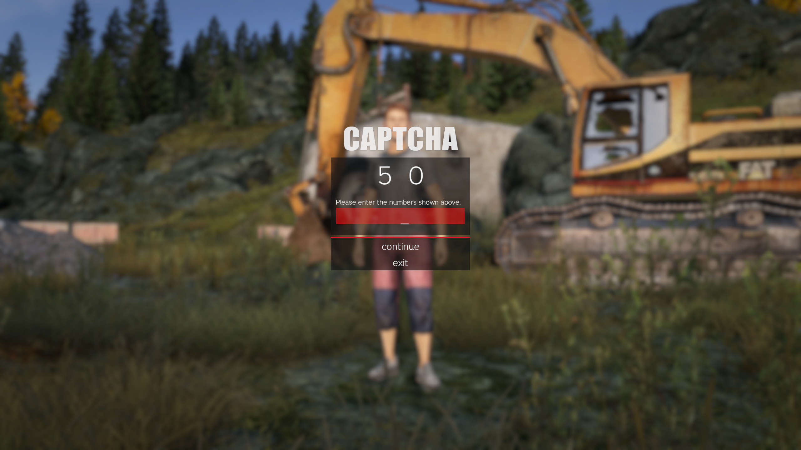
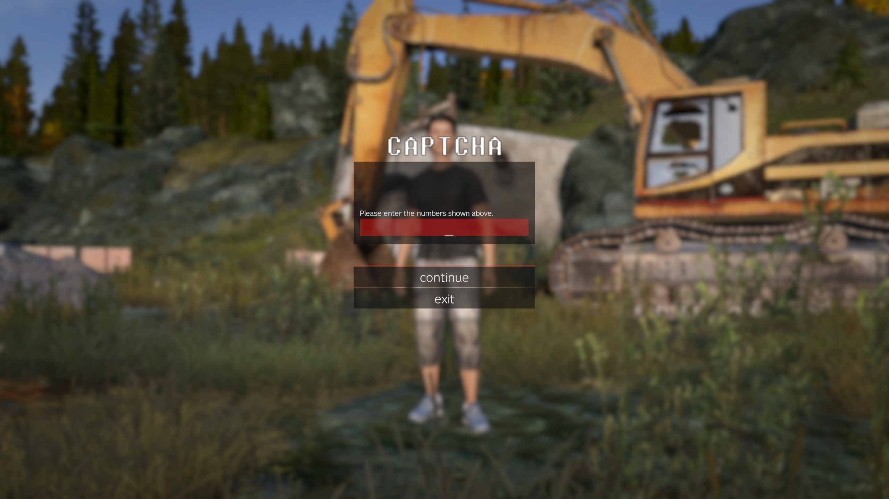

# captcha

DayZ captcha mod, blocks bots and NVIDIA Inspector LOD-bias abuse.

**License:** [CC BY-NC 4.0](LICENSE.txt)



---

## How it works

- On connect, the client shows a 2-digit captcha before joining.
- Three attempts per session, correct answer required to continue.
- Captcha is shown once per game session until the client is restarted.

<table>
  <tr>
    <td width="50%"></td>
    <td width="50%"></td>
  </tr>
  <tr>
    <td align="center"><b>Normal LOD bias (±0)</b></td>
    <td align="center"><b>Higher LOD bias (+1 or higher)</b></td>
  </tr>
</table>

---

## Why do I need this?

NVIDIA Inspector LOD bias lets players pull mip levels that can expose texture detail meant to stay hidden. This mod packs digits into an atlas and draws them on a HUD overlay so bias tricks do not reveal the answer the same way as plain UI textures.

<table>
  <tr>
    <td width="33%"></td>
    <td width="33%"></td>
    <td width="33%"></td>
  </tr>
  <tr>
    <td align="center"><b>Normal LOD bias (±0)</b></td>
    <td align="center"><b>High LOD bias (+3)</b></td>
    <td align="center"><b>Higher LOD bias (+12)</b></td>
  </tr>
</table>

---

## Install

### Server

1. Copy the `@captcha` folder into your DayZ server directory.
2. Place `adelasia.bikey` from `@captcha/keys/` into the server `keys/` folder.
3. Add `@captcha` to your server mod list.
4. Set `verifySignatures = 2` in `serverDZ.cfg`.

### Client

1. Subscribe on Steam Workshop **or** copy `@captcha` into your DayZ mods folder.
2. Enable `@captcha` in the launcher / DZSA mod list.

The client folder must include:

```
@captcha/
  addons/captcha.pbo
  addons/captcha.pbo.adelasia.bisign
  keys/adelasia.bikey
  meta.cpp
```
## Feedback

Report bugs by [opening an issue](https://github.com/adelasia/dayz-captcha/issues).

For suggestions, questions, or general chat, [start a discussion](https://github.com/adelasia/dayz-captcha/discussions).

---

## License

Forks and redistributions must credit adelasia and comply with [CC BY-NC 4.0](LICENSE.txt).
